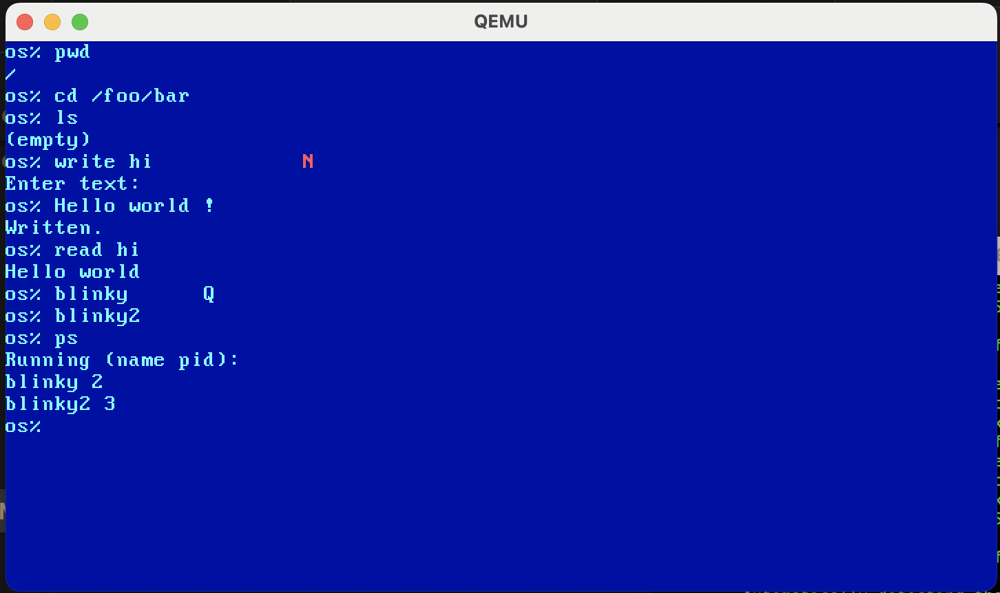
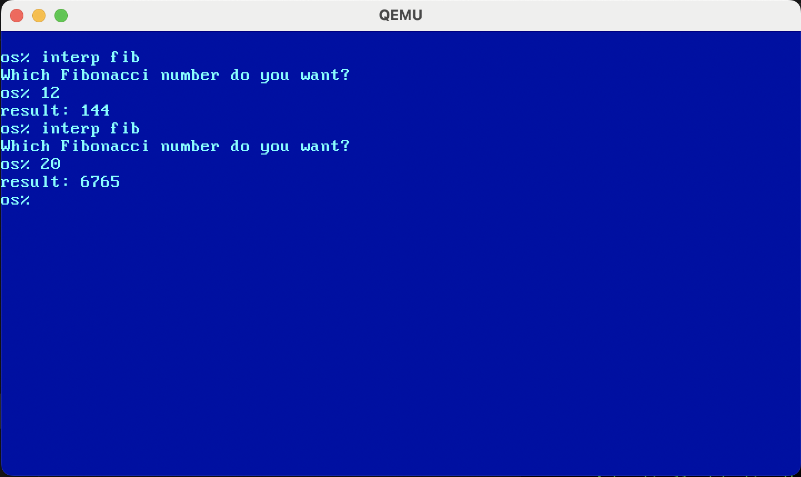
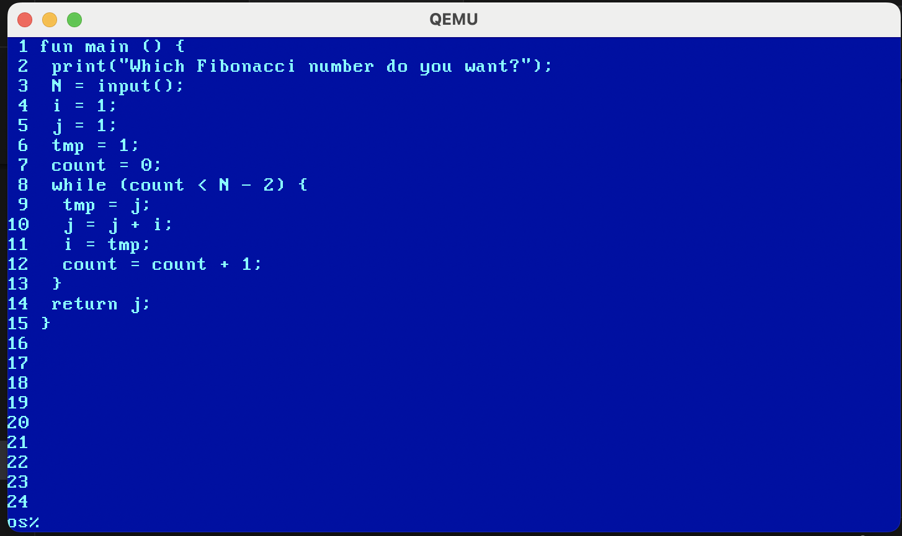

# OS

## Introduction

This is a hobby text-based operating system.

## Setup

**Build:**
 * `make`

**Create disk:**
 * `qemu-img create -f raw disk.img 2M`

*Note:* The current kernel uses a single disk sector as a bitmap to track sector allocation which prevents utilizing more than 2MB.

**Run:**
 * `qemu-system-x86_64 kernel.bin -drive file=disk.img`

## Features

 * **Scheduler** - concurrency supported via round-robin scheduler
 * **Memory management** - page allocator with user/kernel separation
 * **Filesystem** - inspired by Unix but not POSIX-compliant
 * **Syscall interface** - user programs call via `int 0x80` 
 * **Shell** - with commands for managing processes, file operations, etc.
 * **Scripting** - interpreter for a custom language
 * **Text editor** - terminal-based text editor to create/edit files within the OS



## Structure

```
src
├── arch     # bootloader, interrupts, and linker script
├── include  # header files
├── kernel   # scheduler, memory, filesystem, syscalls
├── user     # shell, editor, interpreter, user programs
└── utils    # utility functions
```

## Scripting

The scripting language has a C-like syntax but no typing: all variables are integers. Run a file via `interp <file name>`.

 * **Standard arithmetic**
 * **Variables**
 * **if / else if / else statements**
 * **while loops**
 * **Functions**
 * **print() and input()**

 ```c
fun main() {
    print("Which Fibonacci number do you want?");
    N = input();
    i = 1;
    j = 1;
    tmp = 1;
    count = 0;
    while (count < N - 1) {
        tmp = j;
        j = j + i;
        i = tmp;
        count = count + 1;
    }
    return j;
}
 ```



## Text Editor

Launch by running `editor <file name>`, and control by entering commands at the bottom.

 * **`<line number>`** - allows one to edit the line then press enter to confirm
 * **`u`** - scrolls up 4 lines
 * **`d`** - scrolls down 4 lines
 * **`s`** - saves
 * **`e`** - exits
 * **`i <line number>`** - inserts a blank line after a given line
 * **`r <line number>`** - removes a line

 
